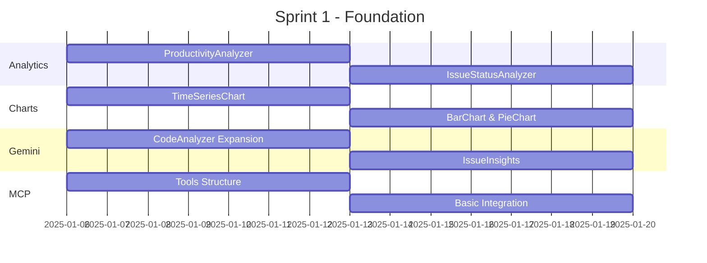

# Plano de Execução - xSwE Agent 🚀

## 📋 Resumo Executivo

**Status**: ✅ Planejamento Completo - Pronto para Execução  
**Data de Início**: 6 de Janeiro de 2025  
**Prazo Estimado**: 4-6 semanas  
**Equipe**: 4-6 desenvolvedores  

### **🎯 Objetivo Principal**
Implementar uma plataforma completa de monitoramento e análise de issues do GitHub com IA, seguindo as prioridades definidas e utilizando trabalho simultâneo para maximizar eficiência.

## 🗂️ Documentos Criados

| Documento | Localização | Descrição |
|-----------|-------------|-----------|
| **Prioridades de Negócio** | `docs/PRIORITIES.md` | Matriz de prioridades P0-P3, roadmap executivo |
| **Workflow de Desenvolvimento** | `docs/DEVELOPMENT_WORKFLOW.md` | Estrutura de branches, processos de git |
| **Plano da Equipe** | `docs/TEAM_PLAN.md` | Divisão de responsabilidades por desenvolvedor |
| **Templates de Sincronização** | `docs/SYNC_TEMPLATES.md` | Templates para reuniões e processos |
| **Framework de Testes** | `tests/conftest.py`, `tests/test_utils.py` | Estrutura completa de testes |

## 🚀 Ready to Start - Checklist Executivo

### ✅ **Configuração Concluída**
- [x] **Branches criadas**: develop + 6 feature branches
- [x] **Framework de testes**: pytest configurado com mocks completos
- [x] **Documentação técnica**: Todos os processos documentados
- [x] **Prioridades definidas**: Matriz P0-P3 com justificativas de negócio
- [x] **Equipe planejada**: Responsabilidades e timelines definidos

### 🎯 **Próximos Passos Imediatos**

#### **Para o Tech Lead (Você)**
1. **Revisar documentos criados** (30min)
2. **Definir equipe final** - Quem vai trabalhar em cada módulo
3. **Configurar ambiente de desenvolvimento**:
   ```bash
   cd /home/rootkit/Apps/xsweAgent
   pip install -r requirements.txt  # Inclui novas deps de teste
   pytest --version  # Verificar framework de testes
   ```
4. **Primeira reunião de kick-off** (usar template criado)

#### **Para a Equipe (Primeiro Dia)**
1. **Clone e setup**:
   ```bash
   git clone <repo-url>
   git checkout develop
   git pull origin develop
   ```
2. **Escolher branch de responsabilidade**:
   - `feature/analytics-engine`
   - `feature/chart-generator`
   - `feature/gemini-integration`
   - `feature/mcp-server-tools`
   - `feature/error-handling`
   - `feature/testing-framework`
3. **Ler documentação específica** do seu módulo
4. **Primeiro commit**: Setup inicial da sua feature

## 🏗️ Trabalho Simultâneo Planejado

### **Sprint 1 (Semanas 1-2): Foundation**


### **Dependências Resolvidas**
✅ **Analytics Engine** → Independente (pode começar)  
✅ **Chart Generator** → Independente (pode usar mock data)  
✅ **Gemini Integration** → Independente (pode usar mock GitHub data)  
✅ **MCP Server** → Pode começar estrutura, integração depois  
✅ **Error Handling** → Independente (melhora todos os módulos)  
✅ **Testing** → Independente (framework já configurado)  

## 📊 Métricas de Sucesso

### **Sprint 1 (MVP)**
- [ ] **Analytics Engine**: Calculando métricas básicas
- [ ] **Chart Generator**: Gerando 3 tipos de gráficos
- [ ] **Gemini Integration**: Analisando código com IA
- [ ] **MCP Server**: 2 ferramentas funcionando
- [ ] **Coverage**: >90% em todos os módulos
- [ ] **Performance**: APIs respondendo <2s

### **Sprint 2 (Production Ready)**
- [ ] **Integração completa** entre todos os módulos
- [ ] **Dashboard funcional** com dados reais
- [ ] **Deploy automatizado** funcionando
- [ ] **Monitoramento** implementado
- [ ] **Documentação** completa para usuários finais

## 🎛️ Comandos de Início Rápido

### **Setup Inicial (Tech Lead)**
```bash
# 1. Atualizar dependências
pip install -r requirements.txt

# 2. Configurar pre-commit (opcional mas recomendado)
pre-commit install

# 3. Verificar testes
pytest tests/test_examples.py -v

# 4. Verificar branches
git branch -a

# 5. Primeira reunião
# Usar template em docs/SYNC_TEMPLATES.md
```

### **Para Cada Desenvolvedor**
```bash
# 1. Checkout da sua feature branch
git checkout feature/analytics-engine  # ou sua branch

# 2. Verificar estrutura do módulo
ls -la src/analytics/  # ou seu módulo

# 3. Rodar testes existentes
pytest tests/test_analytics.py -v  # ou seus testes

# 4. Primeiro commit
git add .
git commit -m "feat(analytics): initial setup and planning"
git push origin feature/analytics-engine
```

## 🔄 Rotina Semanal Estabelecida

### **Segunda-feira**
- **9:00**: Daily Standup (template criado)
- **Foco**: Setup da semana, resolver bloqueios

### **Quarta-feira** 
- **9:00**: Daily Standup
- **14:00**: Technical Review (90min - template criado)
- **Foco**: Qualidade técnica, arquitetura

### **Sexta-feira**
- **9:00**: Daily Standup  
- **16:00**: Integration Session (60min - template criado)
- **Foco**: Demo, integração, planejamento próxima semana

## 🚨 Alertas e Riscos Identificados

### **Riscos Mitigados**
✅ **Dependências entre módulos** → Trabalho independente planejado  
✅ **Falta de testes** → Framework completo criado  
✅ **Conflitos de integração** → Branches e processo definidos  
✅ **Falta de sincronização** → Templates e agenda criados  

### **Riscos a Monitorar**
⚠️ **API Keys do Gemini** → Configurar antes do início  
⚠️ **Rate limiting do GitHub** → Implementar desde o início  
⚠️ **Performance com dados grandes** → Testes de carga planejados  

## 🎯 Call to Action

### **Hoje (5 de Janeiro)**
1. **Review desta documentação** (30min)
2. **Definir equipe final** - Quem vai trabalhar em quê
3. **Configurar API keys** necessárias (GitHub, Gemini)
4. **Agendar kick-off** para segunda-feira

### **Segunda-feira (6 de Janeiro)**
1. **Kick-off meeting** (60min - usar template)
2. **Setup de ambiente** para toda equipe
3. **Primeira atribuição** de tarefas
4. **Primeiro commits** de cada desenvolvedor

### **Final da Primeira Semana (10 de Janeiro)**
1. **Integration Session** (60min - template criado)
2. **Demo** do progresso de cada módulo
3. **Ajustes** de rumo se necessário

## 📞 Suporte e Contato

**Para dúvidas sobre**:
- **Arquitetura técnica** → Consultar `docs/PRIORITIES.md`
- **Processo de desenvolvimento** → Consultar `docs/DEVELOPMENT_WORKFLOW.md`
- **Divisão da equipe** → Consultar `docs/TEAM_PLAN.md`
- **Templates de reunião** → Consultar `docs/SYNC_TEMPLATES.md`
- **Framework de testes** → Ver `tests/conftest.py` e exemplos

---

## 🎉 Conclusão

**Status**: 🟢 **READY TO EXECUTE**

Todos os componentes necessários para execução simultânea estão configurados:
- ✅ Prioridades definidas
- ✅ Branches configuradas  
- ✅ Equipe planejada
- ✅ Processos documentados
- ✅ Framework de testes implementado
- ✅ Templates de sincronização criados

**A equipe pode começar o trabalho imediatamente na segunda-feira!**

---

**Última Atualização**: 5 de Janeiro de 2025  
**Criado por**: GitHub Copilot Assistant  
**Status**: Planejamento Completo ✅